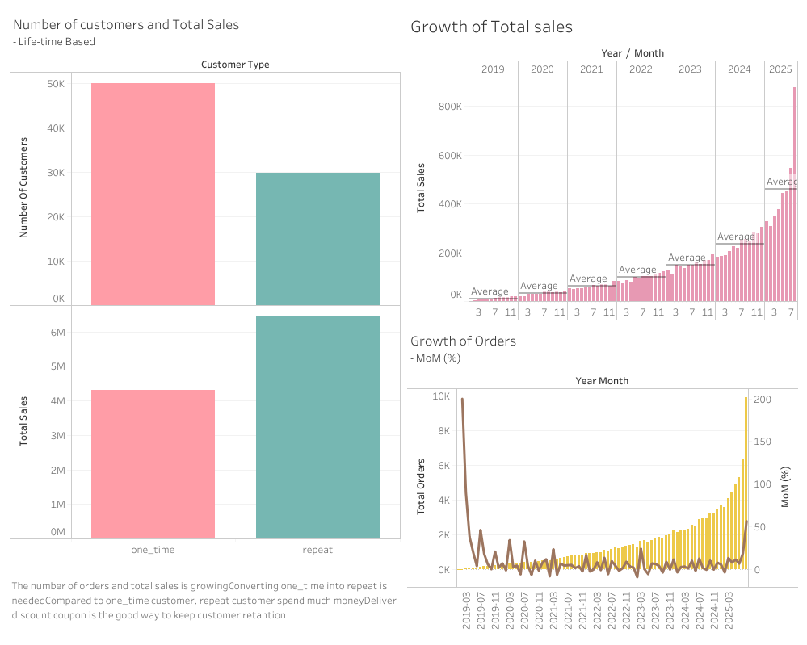

# The Look Ecommerce Analysis

## Project Overview
This project anlyzes The Look Ecommerce data to figure out growth of sales and customer behavior. 
The goal is to identify sales trend and provide insights for marketing strategies aimed at how to accerate the sales.

---

## Data source  
Big Query Public data - [thelook_ecommerce](bigquery-public-data.thelook_ecommerce)
- order_items - [order_items](bigquery-public-data.thelook_ecommerce.order_items)
- orders - [orders](bigquery-public-data.thelook_ecommerce.orders)
- products - [products](bigquery-public-data.thelook_ecommerce.products)

---

##  Tools Used
- **Google BigQuery**: Data cleaning, transformation, and analysis using SQL
- **Tableau**: Data visualization and dashboard creation
- **GitHub**: Version control and portfolio hosting

---

##  Data Processing Steps
1. **Data Examination**  
   - Check columns and data type  
   - Find common columns to combine tables

2. **Data Cleaning**  
   - Check duplicate and invalid orders
   - Check negative sales values (return or cancelled)

3. **Definition for customer type**
customer types were defined from two perspectives:
   1) **Monthly Perspective**
      - *New*: Customers making thir first order in an given month.
      - *Repeat*: Customers placing two or more orders with in the same month.
   2) **Overall Perspective**
      - *One_time*: Customers who placed only one order duaring the entire period.
      - *Repeat*: Customers who placed two or more orders during entire period.

3. **Exploration & Analysis**  
   - Monthly sales(Including MOM), Growth rate of sales total and order numbers
   - Comparison of customer type  
   - Top 10 products per customer type
   - Common product for both customer type

4. **Visualization**  
   - Created interactive dashboard in Tableau (see below)

---

##  Key Insights
- *repeat customer* spend much money than *one_time customer*.
- Weekend is the peak of sales.
- There is a high-selling item common to both customer type
  
## Suggestions
- **Repeat coupon** : Deliver repeat coupons after first purchase to convert *one_time* into *repeat*,
- **Weekend Advertisement** : Run targeting Ads on weekend
- **Key Products** : Use top selling products for the ad image
- **Stock Monitoring** : Decrease sales opotunity loss by monitoring high-selling product stock

##  Dashboard


--- 

##  Repository Structure
```
thelook_ecommerce_analysis/
├── sql/
│ ├── 01_cleaning.sql
│ ├── 02_monthly_sales.sql
│ ├── 03_cohort.sql
├── results/
│ └── exploration_summary.md
├── img/
│ └── dashboard.png
└── README.md
```
---

##  Contact
Created by Asuka Osuki – [LinkedIn](www.linkedin.com/in/asuka-osuki-24958b32b) 
